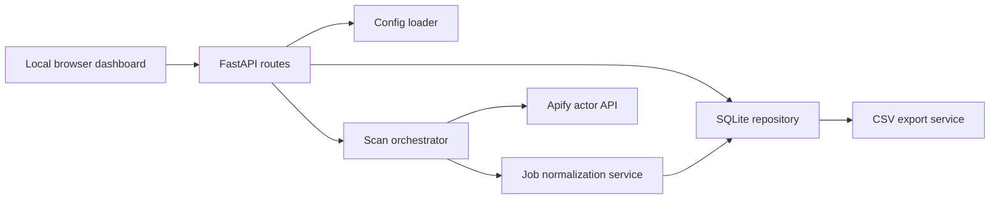

# Upwork Job Research

Local market research dashboard for collecting broad Upwork job data, deduplicating repeated opportunities, filtering by useful buyer signals, and exporting clean CSV analysis files.


## Overview

This app runs locally and helps collect Upwork market data from configurable keywords. It uses Apify for the first scraper integration, stores normalized and raw job payloads in SQLite, merges duplicate jobs across keyword searches, and provides a clean Jinja/Tailwind dashboard for filtering, review status updates, and CSV export.

## Key Features

- Keyword scans from `config/keywords.json`
- Apify actor integration with token-based authentication
- SQLite jobs table with normalized fields plus raw JSON
- Deduplication by external job id, job URL, then title/date/client fallback
- Matched keyword merging for repeated jobs
- Premium local dashboard built with FastAPI, Jinja, Tailwind, and small JavaScript interactions
- Filters for keyword, dates, budget, hourly range, client country, payment verification, status, and text search
- Manual statuses: New, Interesting, Reviewed, Skipped, Applied
- CSV export for the current filtered result set

## Tech Stack

| Layer | Technology |
| --- | --- |
| Web server | FastAPI 0.115+, Uvicorn |
| UI | Jinja2 templates, Tailwind CDN, custom CSS, vanilla JavaScript |
| Data | SQLite through Python `sqlite3` |
| Scraper | Apify synchronous dataset API |
| Validation | Pydantic 2 |
| Tests | Pytest |

## Architecture



## Quick Start

```powershell
uv sync
Copy-Item .env.example .env
```

Edit `.env` and set `APIFY_API_TOKEN`.

```powershell
uv run .\main.py
```

Open:

```text
http://127.0.0.1:8000
```

## Environment Setup

Non-secret app defaults live in `config/settings.json`:

```json
{
  "apify_actor_id": "neatrat/upwork-job-scraper",
  "results_per_keyword": 50,
  "request_timeout_seconds": 120,
  "keywords_path": "config/keywords.json",
  "database_path": "database/upwork_jobs.db",
  "session_secret": "local-upwork-research-dashboard-session",
  "dashboard_host": "127.0.0.1",
  "dashboard_port": 8000
}
```

Use `.env` for secrets and machine-specific overrides:

```dotenv
APIFY_API_TOKEN=your-apify-token
UPWORK_RESEARCH_SETTINGS_PATH=config/settings.json
UPWORK_RESEARCH_APIFY_ACTOR_ID=neatrat/upwork-job-scraper
UPWORK_RESEARCH_RESULTS_PER_KEYWORD=50
UPWORK_RESEARCH_REQUEST_TIMEOUT_SECONDS=120
UPWORK_RESEARCH_KEYWORDS_PATH=config/keywords.json
UPWORK_RESEARCH_DATABASE_PATH=database/upwork_jobs.db
UPWORK_RESEARCH_SESSION_SECRET=replace-with-a-long-random-local-secret
UPWORK_RESEARCH_DASHBOARD_HOST=127.0.0.1
UPWORK_RESEARCH_DASHBOARD_PORT=8000
```

| Variable | Description |
| --- | --- |
| `APIFY_API_TOKEN` | Required for live Upwork scans. |
| `UPWORK_RESEARCH_SETTINGS_PATH` | Optional path to the JSON settings file. |
| `UPWORK_RESEARCH_APIFY_ACTOR_ID` | Optional override for `apify_actor_id`. |
| `UPWORK_RESEARCH_RESULTS_PER_KEYWORD` | Optional override for `results_per_keyword`. |
| `UPWORK_RESEARCH_REQUEST_TIMEOUT_SECONDS` | Optional override for `request_timeout_seconds`. |
| `UPWORK_RESEARCH_KEYWORDS_PATH` | Optional override for `keywords_path`. |
| `UPWORK_RESEARCH_DATABASE_PATH` | Optional override for `database_path`. |
| `UPWORK_RESEARCH_SESSION_SECRET` | Optional override for `session_secret`. |
| `UPWORK_RESEARCH_DASHBOARD_HOST` | Optional override for `dashboard_host`. |
| `UPWORK_RESEARCH_DASHBOARD_PORT` | Optional override for `dashboard_port`. |
| `UPWORK_RESEARCH_SCAN_CONCURRENCY_LIMIT` | Optional override for concurrent keyword scans. |

## Project Structure

```text
upwork-job-research/
+-- config/                         # Editable keyword configuration
|   +-- keywords.json               # Search keywords
|   +-- settings.json               # Non-secret app settings
+-- database/                       # Local SQLite database is created here
+-- docs/                           # Implementation and scraper notes
+-- src/
|   +-- core/                       # Runtime configuration
|   +-- models/                     # Pydantic job and summary models
|   +-- repositories/               # SQLite schema, filters, inserts, row mapping
|   +-- scrapers/                   # Apify scraper client
|   +-- services/                   # Normalization, scan orchestration, CSV export
|   +-- web/                        # FastAPI app, routes, templates, static assets
+-- tests/                          # Behavior tests
+-- main.py                         # Uvicorn entry point
+-- pyproject.toml                  # uv project config
```

## API Documentation

The dashboard exposes local server routes:

| Method | Path | Purpose |
| --- | --- | --- |
| `GET` | `/` | Render dashboard with filters and current jobs. |
| `POST` | `/scan` | Run live Apify scans for all configured keywords. |
| `POST` | `/jobs/{job_id}/status` | Update manual job status. |
| `GET` | `/export.csv` | Export the current filtered result set as CSV. |

Status update example:

```http
POST /jobs/1/status
Content-Type: application/x-www-form-urlencoded

status=Interesting
```

## Deployment

This MVP is designed for local use first.

Run locally:

```powershell
uv run .\main.py
```

Future VPS cron example:

```cron
0 5 * * * cd /path/to/project && /usr/local/bin/uv run python run_scraper.py
```

## Desktop Shortcut

Create a Windows shortcut that runs:

```powershell
powershell.exe -NoExit -Command "cd D:\year_2026\upwork_job_research; uv run uvicorn main:app --host 127.0.0.1 --port 8000"
```

Then open `http://127.0.0.1:8000` in the browser.

## Apify Actor Choice

See [docs/apify-actor-comparison.md](docs/apify-actor-comparison.md) for the actor comparison and rationale.

The default actor is `neatrat/upwork-job-scraper` because `api_docs.md` contains that actor's endpoint and input schema.

## Testing

```powershell
uv run pytest
```

## License and Author

Private project for Rahees Ahmed.
